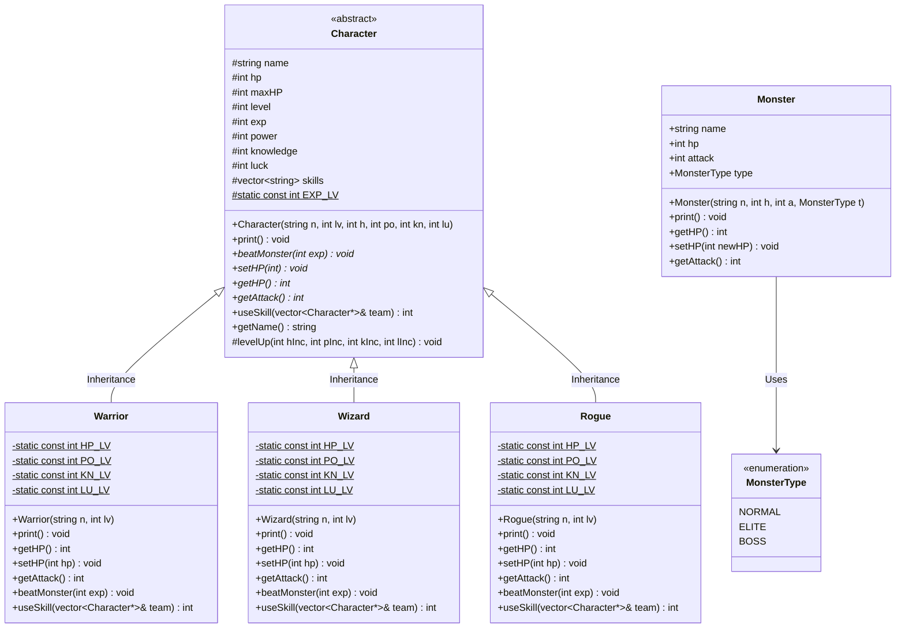
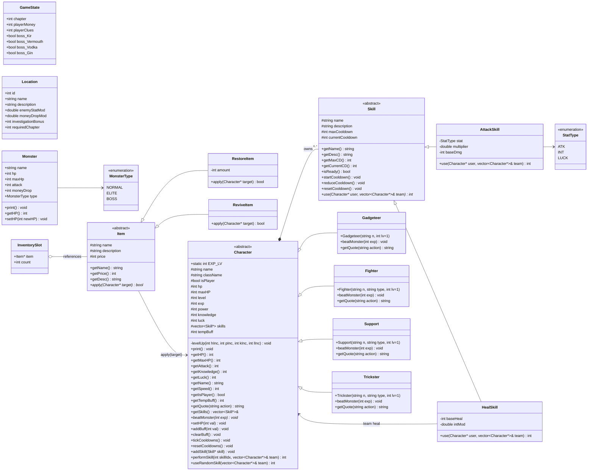

```mermaid
classDiagram
    %% 抽象基底類別
    class Character {
        <<abstract>>
        #string name
        #int hp
        #int maxHP
        #int level
        #int exp
        #int power
        #int knowledge
        #int luck
        #vector~string~ skills
        #static const int EXP_LV$
        +Character(string n, int lv, int h, int po, int kn, int lu)
        +print() void
        +beatMonster(int exp)* void
        +setHP(int)* void
        +getHP()* int
        +getAttack()* int
        +useSkill(vector~Character*~& team) int
        +getName() string
        #levelUp(int hInc, int pInc, int kInc, int lInc) void
    }

    %% 衍生類別 - 戰士
    class Warrior {
        -static const int HP_LV$
        -static const int PO_LV$
        -static const int KN_LV$
        -static const int LU_LV$
        +Warrior(string n, int lv)
        +print() void
        +getHP() int
        +setHP(int hp) void
        +getAttack() int
        +beatMonster(int exp) void
        +useSkill(vector~Character*~& team) int
    }

    %% 衍生類別 - 法師
    class Wizard {
        -static const int HP_LV$
        -static const int PO_LV$
        -static const int KN_LV$
        -static const int LU_LV$
        +Wizard(string n, int lv)
        +print() void
        +getHP() int
        +setHP(int hp) void
        +getAttack() int
        +beatMonster(int exp) void
        +useSkill(vector~Character*~& team) int
    }

    %% 衍生類別 - 盜賊
    class Rogue {
        -static const int HP_LV$
        -static const int PO_LV$
        -static const int KN_LV$
        -static const int LU_LV$
        +Rogue(string n, int lv)
        +print() void
        +getHP() int
        +setHP(int hp) void
        +getAttack() int
        +beatMonster(int exp) void
        +useSkill(vector~Character*~& team) int
    }

    %% 怪物類別
    class Monster {
        +string name
        +int hp
        +int attack
        +MonsterType type
        +Monster(string n, int h, int a, MonsterType t)
        +print() void
        +getHP() int
        +setHP(int newHP) void
        +getAttack() int
    }

    %% 怪物類型列舉
    class MonsterType {
        <<enumeration>>
        NORMAL
        ELITE
        BOSS
    }

    %% 關係定義
    Character <|-- Warrior : Inheritance
    Character <|-- Wizard : Inheritance
    Character <|-- Rogue : Inheritance
    Monster --> MonsterType : Uses
```
\n+## 依據 project.cpp 的完整類別圖（2025-12-27）

```mermaid
classDiagram
    direction LR

    class GameState {
        +int chapter
        +int playerMoney
        +int playerClues
        +bool boss_Kir
        +bool boss_Vermouth
        +bool boss_Vodka
        +bool boss_Gin
    }

    class Location {
        +int id
        +string name
        +string description
        +double enemyStatMod
        +double moneyDropMod
        +int investigationBonus
        +int requiredChapter
    }

    class InventorySlot {
        +Item* item
        +int count
    }

    class Monster {
        +string name
        +int hp
        +int maxHp
        +int attack
        +int moneyDrop
        +MonsterType type
        +print() void
        +getHP() int
        +setHP(int newHP) void
    }

    class MonsterType {
        <<enumeration>>
        NORMAL
        ELITE
        BOSS
    }

    class StatType {
        <<enumeration>>
        ATK
        INT
        LUCK
    }

    class Skill {
        <<abstract>>
        #string name
        #string description
        #int maxCooldown
        #int currentCooldown
        +getName() string
        +getDesc() string
        +getMaxCD() int
        +getCurrentCD() int
        +isReady() bool
        +startCooldown() void
        +reduceCooldown() void
        +resetCooldown() void
        +use(Character* user, vector~Character*~& team)* int
    }

    class AttackSkill {
        -StatType stat
        -double multiplier
        -int baseDmg
        +use(Character* user, vector~Character*~& team) int
    }

    class HealSkill {
        -int baseHeal
        -double intMod
        +use(Character* user, vector~Character*~& team) int
    }

    class Item {
        <<abstract>>
        #string name
        #string description
        #int price
        +getName() string
        +getPrice() int
        +getDesc() string
        +apply(Character* target)* bool
    }

    class RestoreItem {
        -int amount
        +apply(Character* target) bool
    }

    class ReviveItem {
        +apply(Character* target) bool
    }

    class Character {
        <<abstract>>
        +static int EXP_LV
        #string name
        #string className
        #bool isPlayer
        #int hp
        #int maxHP
        #int level
        #int exp
        #int power
        #int knowledge
        #int luck
        #vector~Skill*~ skills
        #int tempBuff
        -levelUp(int hInc, int pInc, int kInc, int lInc) void
        +print() void
        +getHP() int
        +getMaxHP() int
        +getAttack() int
        +getKnowledge() int
        +getLuck() int
        +getName() string
        +getSpeed() int
        +getIsPlayer() bool
        +getTempBuff() int
        +getQuote(string action) string
        +getSkills() vector~Skill*~&
        +beatMonster(int exp)* void
        +setHP(int val) void
        +addBuff(int val) void
        +clearBuff() void
        +tickCooldowns() void
        +resetCooldowns() void
        +addSkill(Skill* skill) void
        +performSkill(int skillIdx, vector~Character*~& team) int
        +useRandomSkill(vector~Character*~& team) int
    }

    class Gadgeteer {
        +Gadgeteer(string n, int lv=1)
        +beatMonster(int exp) void
        +getQuote(string action) string
    }

    class Fighter {
        +Fighter(string n, string type, int lv=1)
        +beatMonster(int exp) void
        +getQuote(string action) string
    }

    class Support {
        +Support(string n, string type, int lv=1)
        +beatMonster(int exp) void
        +getQuote(string action) string
    }

    class Trickster {
        +Trickster(string n, string type, int lv=1)
        +beatMonster(int exp) void
        +getQuote(string action) string
    }

    %% 繼承
    Skill <|-- AttackSkill
    Skill <|-- HealSkill
    Item  <|-- RestoreItem
    Item  <|-- ReviveItem
    Character <|-- Gadgeteer
    Character <|-- Fighter
    Character <|-- Support
    Character <|-- Trickster

    %% 關聯
    Character *-- "0..*" Skill : owns
    InventorySlot o-- Item : references
    Monster --> MonsterType
    AttackSkill --> StatType
    HealSkill --> Character : team heal
    Item --> Character : apply(target)
```