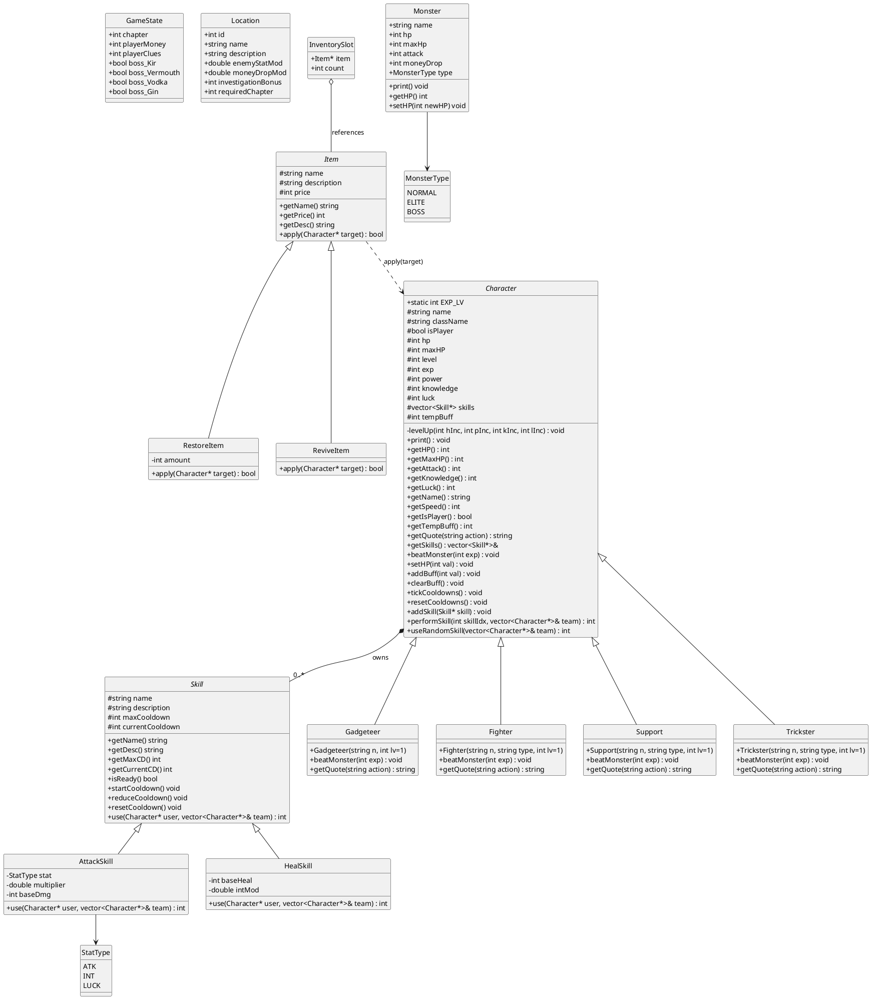

```plantuml
@startuml
skinparam classAttributeIconSize 0
skinparam style strictuml

' ===== 基礎資料類型 =====
class GameState {
  +int chapter
  +int playerMoney
  +int playerClues
  +bool boss_Kir
  +bool boss_Vermouth
  +bool boss_Vodka
  +bool boss_Gin
}

class Location {
  +int id
  +string name
  +string description
  +double enemyStatMod
  +double moneyDropMod
  +int investigationBonus
  +int requiredChapter
}

class InventorySlot {
  +Item* item
  +int count
}

' ===== 怪物與列舉 =====
class Monster {
  +string name
  +int hp
  +int maxHp
  +int attack
  +int moneyDrop
  +MonsterType type
  +print() void
  +getHP() int
  +setHP(int newHP) void
}

enum MonsterType {
  NORMAL
  ELITE
  BOSS
}

' ===== 角色屬性列舉 =====
enum StatType {
  ATK
  INT
  LUCK
}

' ===== 技能與道具 =====
abstract class Skill {
  #string name
  #string description
  #int maxCooldown
  #int currentCooldown
  +getName() string
  +getDesc() string
  +getMaxCD() int
  +getCurrentCD() int
  +isReady() bool
  +startCooldown() void
  +reduceCooldown() void
  +resetCooldown() void
  +use(Character* user, vector<Character*>& team) : int
}

class AttackSkill extends Skill {
  -StatType stat
  -double multiplier
  -int baseDmg
  +use(Character* user, vector<Character*>& team) : int
}

class HealSkill extends Skill {
  -int baseHeal
  -double intMod
  +use(Character* user, vector<Character*>& team) : int
}

abstract class Item {
  #string name
  #string description
  #int price
  +getName() string
  +getPrice() int
  +getDesc() string
  +apply(Character* target) : bool
}

class RestoreItem extends Item {
  -int amount
  +apply(Character* target) : bool
}

class ReviveItem extends Item {
  +apply(Character* target) : bool
}

' ===== 角色與分支 =====
abstract class Character {
  +static int EXP_LV
  #string name
  #string className
  #bool isPlayer
  #int hp
  #int maxHP
  #int level
  #int exp
  #int power
  #int knowledge
  #int luck
  #vector<Skill*> skills
  #int tempBuff
  -levelUp(int hInc, int pInc, int kInc, int lInc) : void
  +print() : void
  +getHP() : int
  +getMaxHP() : int
  +getAttack() : int
  +getKnowledge() : int
  +getLuck() : int
  +getName() : string
  +getSpeed() : int
  +getIsPlayer() : bool
  +getTempBuff() : int
  +getQuote(string action) : string
  +getSkills() : vector<Skill*>&
  +beatMonster(int exp) : void
  +setHP(int val) : void
  +addBuff(int val) : void
  +clearBuff() : void
  +tickCooldowns() : void
  +resetCooldowns() : void
  +addSkill(Skill* skill) : void
  +performSkill(int skillIdx, vector<Character*>& team) : int
  +useRandomSkill(vector<Character*>& team) : int
}

class Gadgeteer extends Character {
  +Gadgeteer(string n, int lv=1)
  +beatMonster(int exp) : void
  +getQuote(string action) : string
}

class Fighter extends Character {
  +Fighter(string n, string type, int lv=1)
  +beatMonster(int exp) : void
  +getQuote(string action) : string
}

class Support extends Character {
  +Support(string n, string type, int lv=1)
  +beatMonster(int exp) : void
  +getQuote(string action) : string
}

class Trickster extends Character {
  +Trickster(string n, string type, int lv=1)
  +beatMonster(int exp) : void
  +getQuote(string action) : string
}

' ===== 關係 =====
Character *-- "0..*" Skill : owns
InventorySlot o-- Item : references
Monster --> MonsterType
AttackSkill --> StatType
Item ..> Character : apply(target)

@enduml
```
