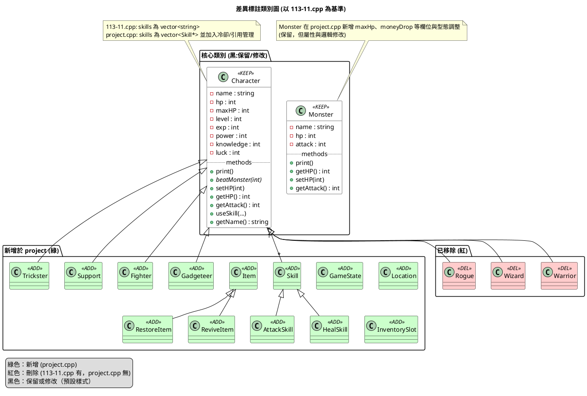

# 差異標註類別圖（以 113-11.cpp 為基準）

以下為以 113-11.cpp 為基準，對 project.cpp 的差異標註 UML。色彩規則：
- 綠色：新增（僅在 project.cpp）
- 紅色：刪除（僅在 113-11.cpp）
- 黑色：保留或修改（兩者皆有，但介面/欄位可能改動）

```plantuml
@startuml
title 差異標註類別圖 (以 113-11.cpp 為基準)

skinparam class {
  BackgroundColor<<ADD>> #ccffcc
  BackgroundColor<<DEL>> #ffcccc
  BorderColor<<KEEP>> Black
  BorderColor Black
}

legend left
綠色：新增 (project.cpp)
紅色：刪除 (113-11.cpp 有，project.cpp 無)
黑色：保留或修改（預設樣式）
endlegend

skinparam classBackgroundColor White
skinparam classBorderColor Black
skinparam ArrowColor Black

package "核心類別 (黑:保留/修改)" {
  class Character <<KEEP>> {
    - name : string
    - hp : int
    - maxHP : int
    - level : int
    - exp : int
    - power : int
    - knowledge : int
    - luck : int
    .. methods ..
    + print()
    + beatMonster(int) {abstract}
    + setHP(int)
    + getHP() : int
    + getAttack() : int
    + useSkill(...)
    + getName() : string
  }

  class Monster <<KEEP>> {
    - name : string
    - hp : int
    - attack : int
    .. methods ..
    + print()
    + getHP() : int
    + setHP(int)
    + getAttack() : int
  }
}

package "新增於 project (綠)" {
  class Skill <<ADD>>
  class AttackSkill <<ADD>>
  class HealSkill <<ADD>>
  class Item <<ADD>>
  class RestoreItem <<ADD>>
  class ReviveItem <<ADD>>
  class Gadgeteer <<ADD>>
  class Fighter <<ADD>>
  class Support <<ADD>>
  class Trickster <<ADD>>
  class GameState <<ADD>>
  class Location <<ADD>>
  class InventorySlot <<ADD>>
}

package "已移除 (紅)" {
  class Warrior <<DEL>>
  class Wizard <<DEL>>
  class Rogue <<DEL>>
}

' 繼承與組合 / 關聯（以差異色標示）
Character "1" o-- "*" Skill
Skill <|-- AttackSkill
Skill <|-- HealSkill
Item <|-- RestoreItem
Item <|-- ReviveItem

Character <|-- Gadgeteer
Character <|-- Fighter
Character <|-- Support
Character <|-- Trickster

Character <|-- Warrior
Character <|-- Wizard
Character <|-- Rogue

note as N1
113-11.cpp: skills 為 vector<string>
project.cpp: skills 為 vector<Skill*> 並加入冷卻/引用管理
end note
N1 .. Character

note as N2
Monster 在 project.cpp 新增 maxHp、moneyDrop 等欄位與型態調整
(保留，但屬性與邏輯修改)
end note
N2 .. Monster

@enduml
```
