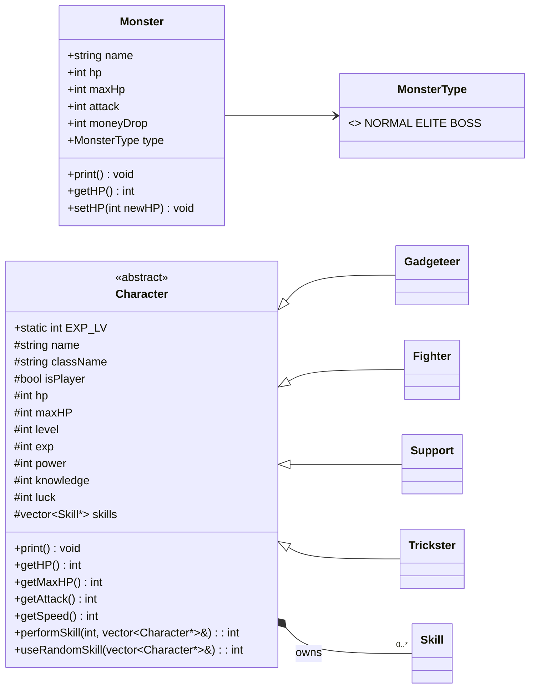
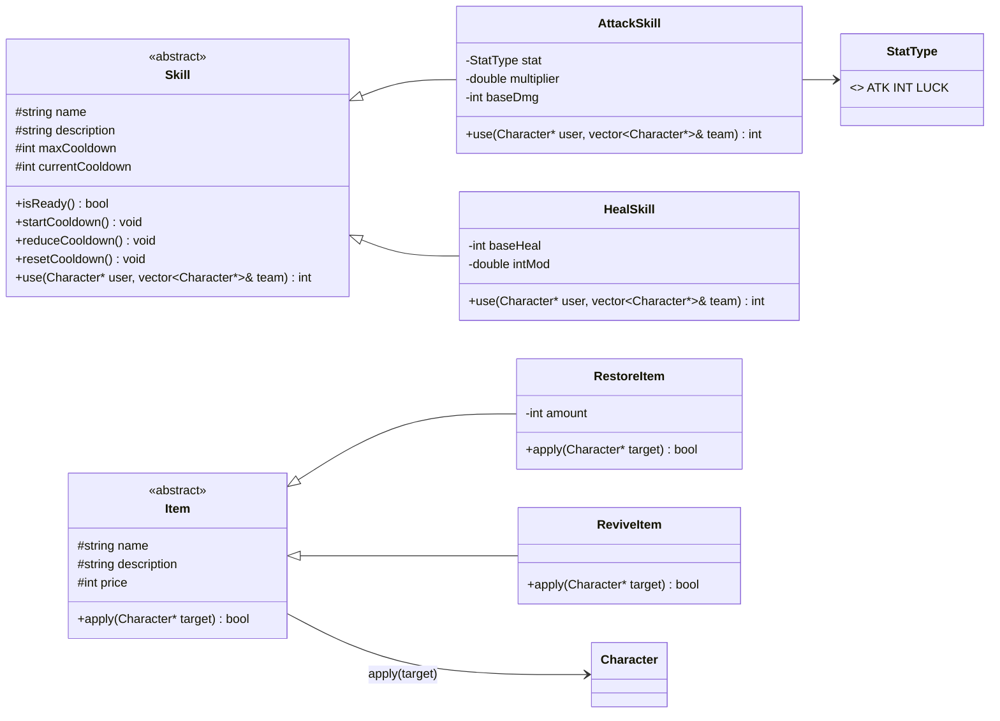
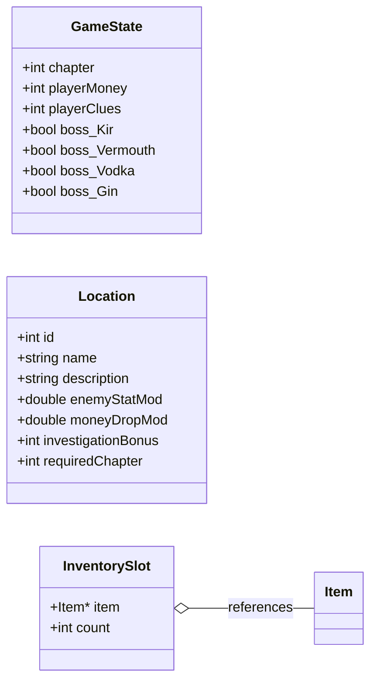

# 依據 project.cpp 的拆分類別圖（2025-12-27）

```mermaid
%% 戰鬥系統
classDiagram
    direction LR

    class Monster {
        +string name
        +int hp
        +int maxHp
        +int attack
        +int moneyDrop
        +MonsterType type
        +print() void
        +getHP() int
        +setHP(int newHP) void
    }

    class MonsterType { <<enumeration>> NORMAL ELITE BOSS }

    class Character {
        <<abstract>>
        +static int EXP_LV
        #string name
        #string className
        #bool isPlayer
        #int hp
        #int maxHP
        #int level
        #int exp
        #int power
        #int knowledge
        #int luck
        #vector~Skill*~ skills
        +print() void
        +getHP() int
        +getMaxHP() int
        +getAttack() int
        +getSpeed() int
        +performSkill(int, vector~Character*~&): int
        +useRandomSkill(vector~Character*~&): int
    }

    class Gadgeteer
    class Fighter
    class Support
    class Trickster

    Character <|-- Gadgeteer
    Character <|-- Fighter
    Character <|-- Support
    Character <|-- Trickster
    Character *-- "0..*" Skill : owns
    Monster --> MonsterType
```

```mermaid
%% 道具與技能
classDiagram
    direction LR

    class StatType { <<enumeration>> ATK INT LUCK }

    class Skill {
        <<abstract>>
        #string name
        #string description
        #int maxCooldown
        #int currentCooldown
        +isReady() bool
        +startCooldown() void
        +reduceCooldown() void
        +resetCooldown() void
        +use(Character* user, vector~Character*~& team) int
    }

    class AttackSkill {
        -StatType stat
        -double multiplier
        -int baseDmg
        +use(Character* user, vector~Character*~& team) int
    }

    class HealSkill {
        -int baseHeal
        -double intMod
        +use(Character* user, vector~Character*~& team) int
    }

    class Item {
        <<abstract>>
        #string name
        #string description
        #int price
        +apply(Character* target) bool
    }

    class RestoreItem {
        -int amount
        +apply(Character* target) bool
    }

    class ReviveItem {
        +apply(Character* target) bool
    }

    Skill <|-- AttackSkill
    Skill <|-- HealSkill
    Item <|-- RestoreItem
    Item <|-- ReviveItem
    AttackSkill --> StatType
    Item --> Character : apply(target)
```

```mermaid
%% 劇情狀態與地點
classDiagram
    direction LR

    class GameState {
        +int chapter
        +int playerMoney
        +int playerClues
        +bool boss_Kir
        +bool boss_Vermouth
        +bool boss_Vodka
        +bool boss_Gin
    }

    class Location {
        +int id
        +string name
        +string description
        +double enemyStatMod
        +double moneyDropMod
        +int investigationBonus
        +int requiredChapter
    }

    class InventorySlot {
        +Item* item
        +int count
    }

    InventorySlot o-- Item : references
```

