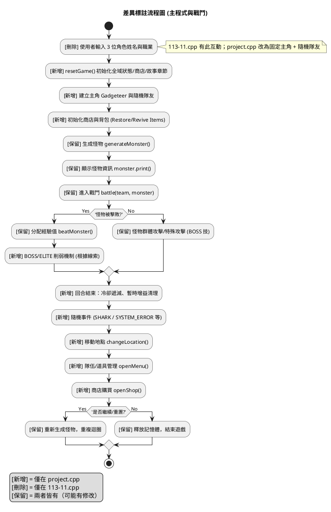

# 差異標註流程圖（以 113-11.cpp 為基準）

以下為主流程與戰鬥流程的差異標註活動圖。色彩規則：
- 綠色：新增（僅在 project.cpp）
- 紅色：刪除（僅在 113-11.cpp）
- 黑色：保留或修改（兩者皆有，但流程/細節改動）

```plantuml
@startuml
title 差異標註流程圖 (主程式與戰鬥)

legend left
[新增] = 僅在 project.cpp
[刪除] = 僅在 113-11.cpp
[保留] = 兩者皆有（可能有修改）
endlegend

start

:[刪除] 使用者輸入 3 位角色姓名與職業;
note right
113-11.cpp 有此互動；project.cpp 改為固定主角 + 隨機隊友
end note

:[新增] resetGame() 初始化全域狀態/商店/故事章節;
:[新增] 建立主角 Gadgeteer 與隨機隊友;
:[新增] 初始化商店與背包 (Restore/Revive Items);

:[保留] 生成怪物 generateMonster();
:[保留] 顯示怪物資訊 monster.print();

:[保留] 進入戰鬥 battle(team, monster);

if ('怪物被擊敗?') then (Yes)
  :[保留] 分配經驗值 beatMonster();
  :[新增] BOSS/ELITE 削弱機制 (根據線索);
else (No)
  :[保留] 怪物群體攻擊/特殊攻擊 (BOSS 技);
endif

:[新增] 回合結束：冷卻遞減、暫時增益清理;

:[新增] 隨機事件 (SHARK / SYSTEM_ERROR 等);
:[新增] 移動地點 changeLocation();
:[新增] 隊伍/道具管理 openMenu();
:[新增] 商店購買 openShop();

if ('是否繼續/重置?') then (Yes)
  :[保留] 重新生成怪物，重複迴圈;
else (No)
  :[保留] 釋放記憶體，結束遊戲;
endif

stop
@enduml
```
