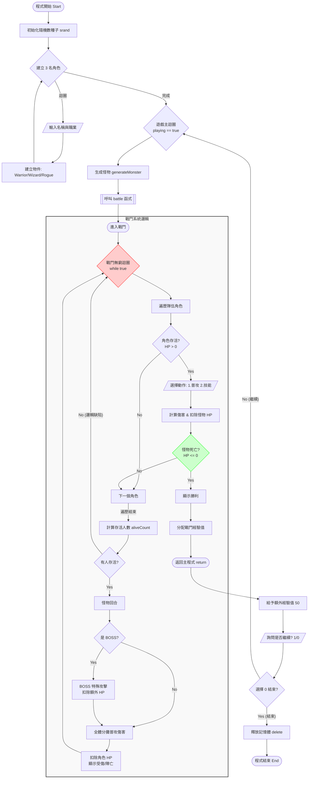
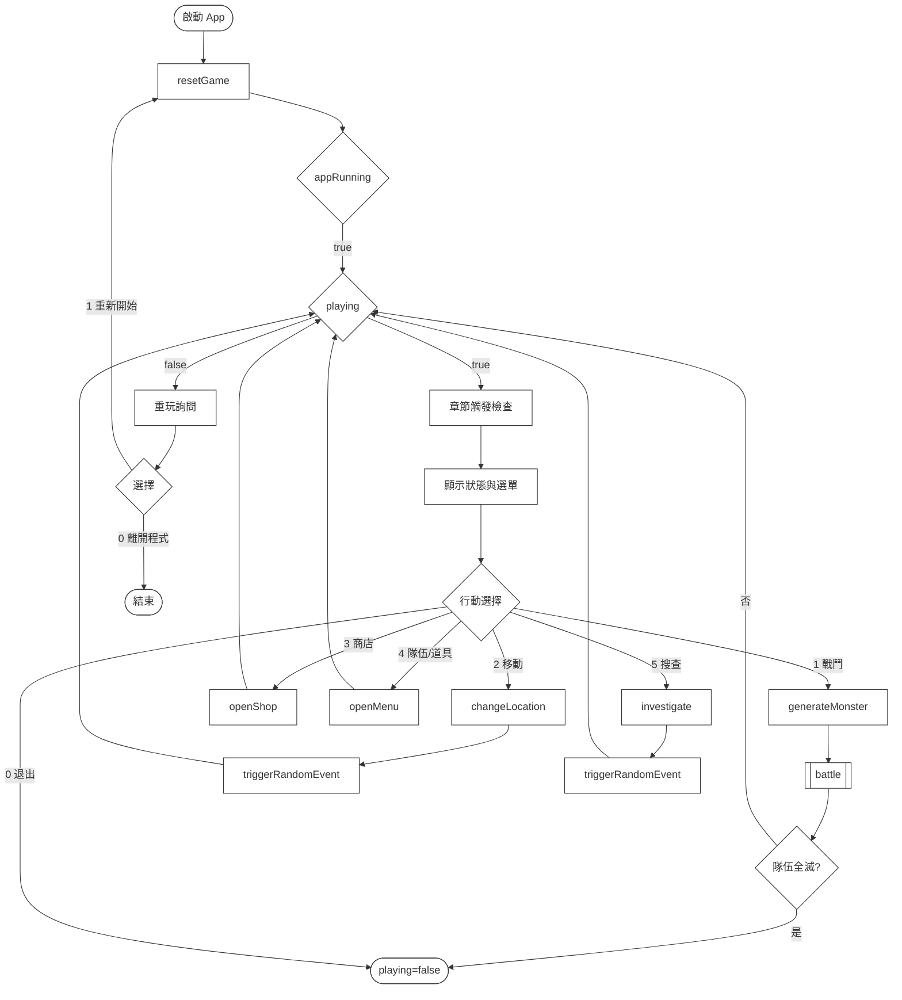
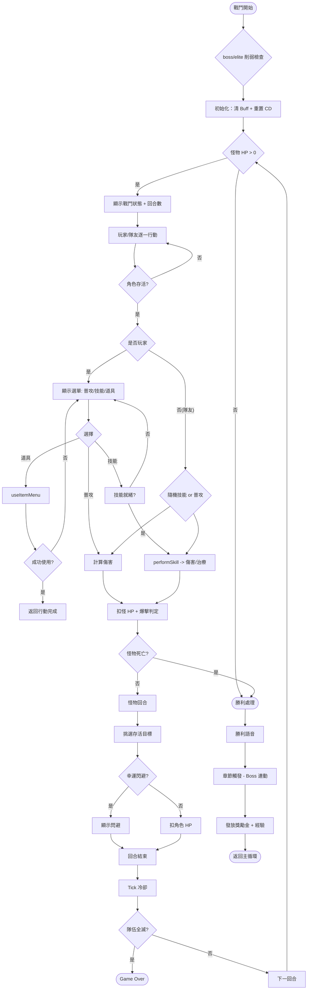
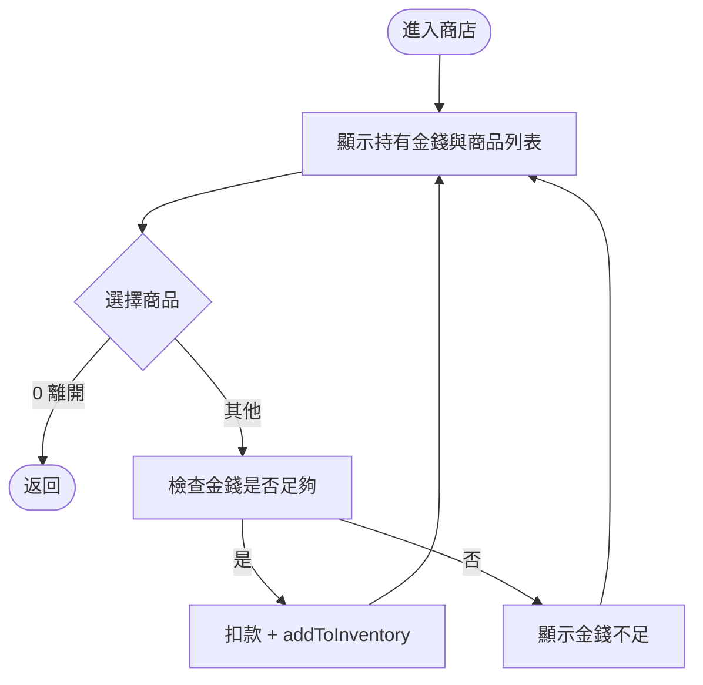
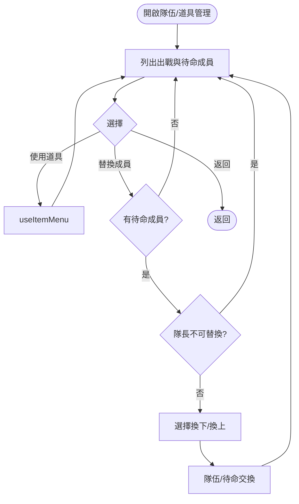
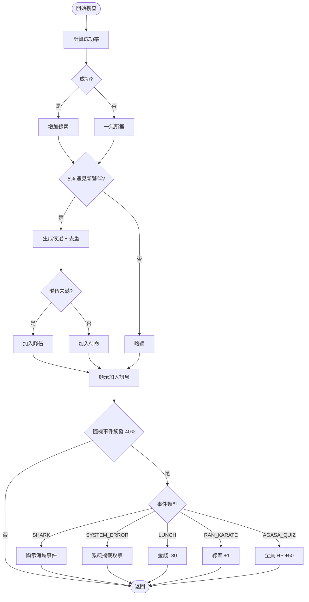

# 依據 113-11.cpp 的流程圖

```mermaid
flowchart TD
    %% 主程式流程
    Start([程式開始 Start]) --> Init[初始化隨機數種子 srand]
    Init --> CreateStart{建立 3 名角色}
    CreateStart -->|迴圈| InputInfo[/輸入名稱與職業/]
    InputInfo --> CreateObj[建立物件: Warrior/Wizard/Rogue]
    CreateObj --> CreateStart
    
    CreateStart -->|完成| GameLoop{遊戲主迴圈<br>playing == true}
    
    GameLoop --> GenMon[生成怪物 generateMonster]
    GenMon --> BattleCall[[呼叫 battle 函式]]
    
    %% 戰鬥系統子流程
    subgraph BattleSystem [戰鬥系統邏輯]
        BattleStart([進入戰鬥]) --> BattleLoop{戰鬥無窮迴圈<br>while true}
        
        %% 玩家回合
        BattleLoop --> PlayerTurn[遍歷隊伍角色]
        PlayerTurn --> CheckHP{角色存活?<br>HP > 0}
        CheckHP -- No --> NextChar
        CheckHP -- Yes --> Action[/選擇動作: 1.普攻 2.技能/]
        Action --> CalcDmg[計算傷害 & 扣除怪物 HP]
        CalcDmg --> CheckMonDead{怪物死亡?<br>HP <= 0}
        
        CheckMonDead -- Yes --> WinMsg[顯示勝利]
        WinMsg --> BattleExp[分配戰鬥經驗值]
        BattleExp --> BattleRet([返回主程式 return])
        
        CheckMonDead -- No --> NextChar[下一個角色]
        NextChar -->|遍歷結束| CheckAlive[計算存活人數 aliveCount]
        
        %% 怪物回合 & 邏輯缺陷處
        CheckAlive --> AnyAlive{有人存活?}
        AnyAlive -- No (邏輯缺陷) --> BattleLoop
        
        AnyAlive -- Yes --> MonAtk[怪物回合]
        MonAtk --> IsBoss{是 BOSS?}
        IsBoss -- Yes --> BossSkill[BOSS 特殊攻擊<br>扣除額外 HP]
        IsBoss -- No --> NormalAtk
        BossSkill --> NormalAtk[全體分攤普攻傷害]
        NormalAtk --> ApplyDmg[扣除角色 HP<br>顯示受傷/陣亡]
        ApplyDmg --> BattleLoop
    end
    
    %% 連接點
    BattleCall --> BattleStart
    BattleRet --> MainExp[給予額外經驗值 50]
    
    %% 結束判斷
    MainExp --> AskCont[/詢問是否繼續? 1/0/]
    AskCont --> CheckCont{選擇 0 結束?}
    CheckCont -- No (繼續) --> GameLoop
    CheckCont -- Yes (結束) --> Cleanup[釋放記憶體 delete]
    Cleanup --> End([程式結束 End])

    %% 樣式設定
    style BattleSystem fill:#f9f9f9,stroke:#333,stroke-width:2px
    style BattleLoop fill:#ffcccc,stroke:#f00
    style CheckMonDead fill:#ccffcc,stroke:#0f0
```
---

# 依據 project.cpp 的流程圖（2025-12-27）

```mermaid
%% 總覽：應用主流程
flowchart TD
    A([啟動 App]) --> B[resetGame]
    B --> C{appRunning}
    C -- true --> D{playing}
    D -- true --> E[章節觸發檢查]
    E --> F[顯示狀態與選單]
    F --> G{行動選擇}
    G -- 1 戰鬥 --> H[generateMonster]
    H --> I[[battle]]
    I --> J{隊伍全滅?}
    J -- 是 --> D_false([playing=false])
    J -- 否 --> D
    G -- 2 移動 --> K[changeLocation]
    K --> L[triggerRandomEvent]
    L --> D
    G -- 3 商店 --> M[openShop]
    M --> D
    G -- 4 隊伍/道具 --> N[openMenu]
    N --> D
    G -- 5 搜查 --> O[investigate]
    O --> P[triggerRandomEvent]
    P --> D
    G -- 0 退出 --> D_false
    D -- false --> Q[重玩詢問]
    Q --> R{選擇}
    R -- 1 重新開始 --> B
    R -- 0 離開程式 --> S([結束])

    classDef node fill:#fff,stroke:#333,stroke-width:1px
    class A,B,C,D,E,F,G,H,I,J,K,L,M,N,O,P,Q,R,S,D_false node
```

```mermaid
%% 詳細：battle 戰鬥流程
flowchart TD
    A([戰鬥開始]) --> B{boss/elite 削弱檢查}
    B --> C[初始化：清 Buff + 重置 CD]
    C --> D{怪物 HP > 0}
    D -- 否 --> Z1([勝利處理])
    D -- 是 --> E[顯示戰鬥狀態 + 回合數]
    E --> F[玩家/隊友逐一行動]
    F --> G{角色存活?}
    G -- 否 --> F
    G -- 是 --> H{是否玩家}
    H -- 是 --> I[顯示選單: 普攻/技能/道具]
    I --> J{選擇}
    J -- 普攻 --> K[計算傷害]
    J -- 技能 --> L[技能就緒?]
    L -- 否 --> I
    L -- 是 --> M[performSkill -> 傷害/治療]
    J -- 道具 --> N[useItemMenu]
    N --> O{成功使用?}
    O -- 否 --> I
    O -- 是 --> P[返回行動完成]
    H -- 否(隊友) --> Q{隨機技能 or 普攻}
    Q --> K
    Q --> M
    K --> R[扣怪 HP + 爆擊判定]
    M --> R
    R --> S{怪物死亡?}
    S -- 是 --> Z1
    S -- 否 --> T[怪物回合]
    T --> U[挑選存活目標]
    U --> V{幸運閃避?}
    V -- 是 --> W[顯示閃避]
    V -- 否 --> X[扣角色 HP]
    W --> Y[回合結束]
    X --> Y
    Y --> Z[Tick 冷卻]
    Z --> AA{隊伍全滅?}
    AA -- 是 --> AB([Game Over])
    AA -- 否 --> AC[下一回合]
    AC --> D

    Z1 --> Z1a[勝利語音]
    Z1a --> Z1b[章節觸發 - Boss 連動]
    Z1b --> Z1c[發放獎勵金 + 經驗]
    Z1c --> Z1d([返回主循環])
```

```mermaid
%% 詳細：openShop 商店流程
flowchart TD
    A([進入商店]) --> B[顯示持有金錢與商品列表]
    B --> C{選擇商品}
    C -- 0 離開 --> Z([返回])
    C -- 其他 --> D[檢查金錢是否足夠]
    D -- 是 --> E[扣款 + addToInventory]
    E --> B
    D -- 否 --> F[顯示金錢不足]
    F --> B
```

```mermaid
%% 詳細：openMenu 隊伍/道具管理
flowchart TD
    A([開啟隊伍/道具管理]) --> B[列出出戰與待命成員]
    B --> C{選擇}
    C -- 使用道具 --> D[useItemMenu]
    D --> B
    C -- 替換成員 --> E{有待命成員?}
    E -- 否 --> B
    E -- 是 --> F{隊長不可替換?}
    F -- 是 --> B
    F -- 否 --> G[選擇換下/換上]
    G --> H[隊伍/待命交換]
    H --> B
    C -- 返回 --> Z([返回])
```

```mermaid
%% 詳細：investigate + triggerRandomEvent
flowchart TD
    A([開始搜查]) --> B[計算成功率]
    B --> C{成功?}
    C -- 是 --> D[增加線索]
    C -- 否 --> E[一無所獲]
    D --> F{5% 遇見新夥伴?}
    E --> F
    F -- 是 --> G[生成候選 + 去重]
    G --> H{隊伍未滿?}
    H -- 是 --> I[加入隊伍]
    H -- 否 --> J[加入待命]
    F -- 否 --> K[略過]
    I --> L[顯示加入訊息]
    J --> L
    K --> L
    L --> M{隨機事件觸發 40%}
    M -- 否 --> Z([返回])
    M -- 是 --> N{事件類型}
    N -- SHARK --> O[顯示海域事件]
    N -- SYSTEM_ERROR --> P[系統攔截攻擊]
    N -- LUNCH --> Q[金錢 -30]
    N -- RAN_KARATE --> R[線索 +1]
    N -- AGASA_QUIZ --> S[全員 HP +50]
    O --> Z
    P --> Z
    Q --> Z
    R --> Z
    S --> Z
```

